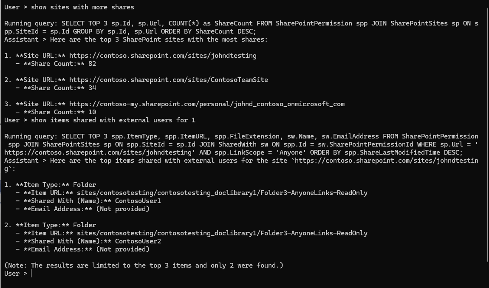

### ChatGPT Bot for SharePoint Data Connector

This solution has two projects. The main idea is to get data extracted by SharePoint Data Connector and transform in a SQL Database.

The SQL database is very simple and not at all in best normalization practices. The idea is to have a simple database to show the data extracted from SharePoint.

## Project 1 - Graph Data Connector to SQL (SPGraphConnector)

You may use CreateDatabase.sql to create the database and tables. 
The connection string is hardcoded in Program.cs to use local DB (no server) and requires that the Database is already created using the script in CreateDatabase.sql.

If you want to use a different server you need to change the connection string in Program.cs:

```csharp
var connectionString = "Data Source=(localdb)\\MSSQLLocalDB;Initial Catalog=SPGraphConnector;Integrated Security=True;Connect Timeout=30;Encrypt=False;";
```

When you run the project, it will extract data from the Datasets from Graph Connector that are not a valid json file.

The file names are also hard coded in Program.cs:

```csharp
SharePointSitesImporter sharePointSitesImporter = new SharePointSitesImporter(connectionString);
sharePointSitesImporter.ImportData("BasicDataSet_v0.SharePointSites_v1.txt");
SharePointGroupsImporter sharePointGroupsImporter = new SharePointGroupsImporter(connectionString, "BasicDataSet_v0.SharePointGroups_v1.txt");
sharePointGroupsImporter.Import();
SharePointPermissionsImporter sharePointPermissionsImporter = new SharePointPermissionsImporter(connectionString);
sharePointPermissionsImporter.ImportFromFile("BasicDataSet_v0.SharePointPermissions_v1.txt");
```

## Project 2 - ChatGPT Bot (securitybot)

This project is a simple bot that uses the data from the SQL Database to answer questions about the SharePoint Sites, Groups and Permissions.

Unlike the other project, this one uses the connection string and other settings from the .env file.

It comes with a .env.example file that you can use to create your own .env file:

```env
# rename site to .env
# Deployment name for Azure and Name of the Model for OpenAI
MODELID="mygpt-4o"
ENDPOINT="https://contoso-openai-eastus2.openai.azure.com/"
APIKEY="<ADD YOR KEY>"
CONNECTIONSTRING="Data Source=(localdb)\\MSSQLLocalDB;Initial Catalog=SPGraphConnector;Integrated Security=True;Connect Timeout=30;Encrypt=False;"
```

- **MODELID** has different meanings for Azure OpenAI and OpenAI. For Azure OpenAI it is the Deployment Name and for OpenAI it is the Model Name.
- **ENDPOINT** is the endpoint for your Azure OpenAI or the OpenAI API.
- **APIKEY** is the API Key for your Azure OpenAI or OpenAI.
- **CONNECTIONSTRING** is the connection string for your SQL Database.

When you run the project, a console will appear and you can start asking questions about the SharePoint Sites, Groups and Permissions.

The bot will use the data from the SQL Database to answer the questions. And it will show the SQL query used to get the data.

Notice that this is just a proof of concept and the important part is how the model is instructed by tablesdefinition.txt.

The application will look like the screenshot below:



## You can find information about SharePoint schemas for GRaph Data Connector in the following link:

[SharePoint schemas for Graph Data Connector](https://github.com/microsoftgraph/dataconnect-solutions/tree/main/datasetschemas)


