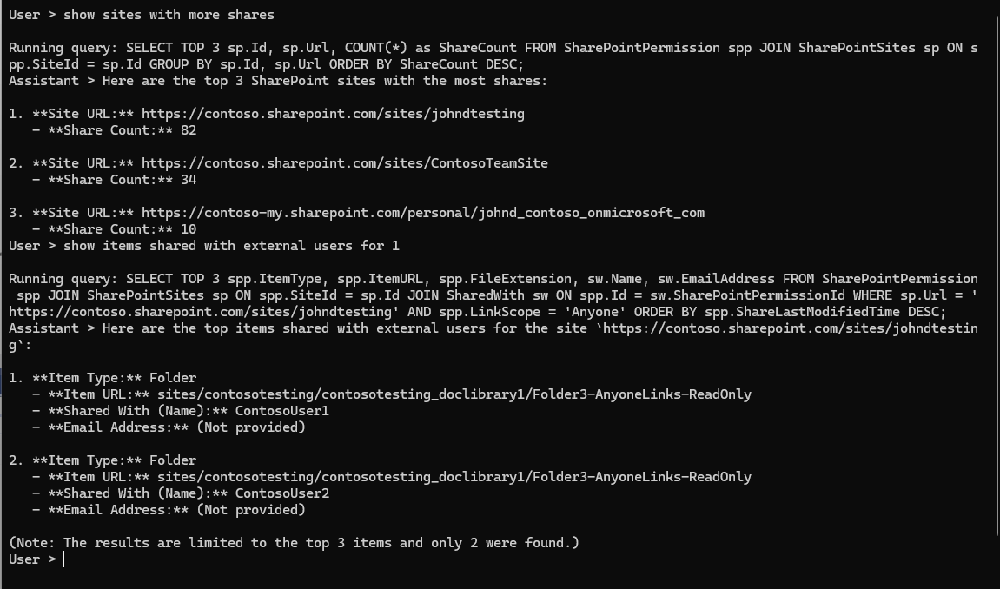

# SecurityBot - AI-Powered SharePoint Security Auditor

## Overview

SecurityBot is an intelligent chatbot that uses AI (via Ollama or Azure OpenAI) to answer questions about SharePoint security, permissions, and site configurations using natural language. It automatically generates and executes SQL queries against the SPGraphConnector database to provide accurate, data-driven responses.

## What It Does

SecurityBot acts as a SharePoint security auditor that can:
- ?? Answer questions about SharePoint sites, permissions, and users
- ?? Automatically generate SQL queries based on natural language questions
- ?? Return formatted results with explanations
- ?? Audit security configurations and permission structures
- ?? Identify site owners, group memberships, and sharing patterns
- ?? Analyze storage usage and site metrics

**Example Questions:**
- "Show me the top 3 largest SharePoint sites"
- "Which sites is john.doe@contoso.com an owner of?"
- "List all sites that are connected to Teams"
- "What are the permissions for site X?"
- "Show me all sites with external sharing enabled"

## Features

? **Natural Language Processing** - Ask questions in plain English  
? **Automatic SQL Generation** - AI creates optimized queries  
? **Function Calling** - Leverages AI tool calling for SQL execution  
? **Multiple AI Providers** - Works with Ollama (local/free) or Azure OpenAI (cloud)  
? **Conversational** - Maintains chat history for context  
? **Safe Queries** - Optional query validation to prevent unsafe operations  

## Prerequisites

- .NET 8 SDK (required)
- **SQL Server database with SharePoint data** - You should have EITHER:
  - ? Restored from `SPGraphConnector.bak` or `.bacpac` backup files (recommended - ready to use!), OR
  - ? Run the SPGraphConnector project to import your own data

  ?? **Important:** If you restored from backup, the database is ready - do NOT run SPGraphConnector!

- **One of the following AI providers:**
  - **Ollama** (recommended for local/free usage) with a function-calling capable model, OR
  - **OpenAI API** (cloud, pay-per-use), OR
  - **Azure OpenAI** (enterprise cloud service)

## Installation

### Option 1: Using Ollama (Local, Free, Recommended)

1. **Install Ollama:**
   - Download from [ollama.com](https://ollama.com)
   - Follow installation instructions for your OS

2. **Pull a function-calling capable model:**
   ```bash
   # Recommended models that support function calling
   ollama pull llama3.2
   # OR
   ollama pull qwen2.5
   ```

3. **Verify Ollama is running:**
   ```bash
   # Should return a list of models
   ollama list

   # Test the OpenAI-compatible endpoint
   curl http://localhost:11434/v1/models
   ```

4. **Configure environment variables:**

   Copy `.env.example` to `.env`:
   ```bash
   cp .env.example .env
   ```

   Edit `.env`:
   ```env
   MODELID="llama3.2"
   ENDPOINT="http://localhost:11434/v1"
   APIKEY="ollama"
   CONNECTIONSTRING="Data Source=(localdb)\\MSSQLLocalDB;Initial Catalog=SPGraphConnector;Integrated Security=True;Connect Timeout=30;Encrypt=False;"
   ```

### Option 2: Using OpenAI API (Cloud, Pay-per-Use)

1. **Get API key:**
   - Sign up at [OpenAI Platform](https://platform.openai.com/)
   - Navigate to API keys
   - Create a new API key

2. **Configure environment variables:**

   Copy `.env.example` to `.env` and edit:
   ```env
   MODELID="gpt-4o"
   ENDPOINT="https://api.openai.com/v1"
   APIKEY="sk-your-openai-api-key-here"
   CONNECTIONSTRING="Data Source=(localdb)\\MSSQLLocalDB;Initial Catalog=SPGraphConnector;Integrated Security=True;Connect Timeout=30;Encrypt=False;"
   ```

### Option 3: Using Azure OpenAI (Cloud, Enterprise)

1. **Create Azure OpenAI resource:**
   - Go to [Azure Portal](https://portal.azure.com)
   - Create an Azure OpenAI resource
   - Deploy a model (e.g., GPT-4, GPT-4o)

2. **Get credentials:**
   - Navigate to your Azure OpenAI resource
   - Go to **Keys and Endpoint**
   - Copy the endpoint and key

3. **Configure environment variables:**

   Copy `.env.example` to `.env` and edit:
   ```env
   MODELID="your-deployment-name"
   ENDPOINT="https://your-resource.openai.azure.com/"
   APIKEY="your-api-key-here"
   CONNECTIONSTRING="Data Source=(localdb)\\MSSQLLocalDB;Initial Catalog=SPGraphConnector;Integrated Security=True;Connect Timeout=30;Encrypt=False;"
   ```

## Configuration

### AI Provider Comparison

| Feature | Ollama | OpenAI API | Azure OpenAI |
|---------|--------|------------|--------------|
| **Cost** | Free | Pay-per-use | Pay-per-use |
| **Privacy** | 100% local | Cloud (shared) | Cloud (enterprise) |
| **Setup** | Local install | API key only | Azure resource |
| **Function Calling** | ? Yes | ? Yes | ? Yes |
| **Best For** | Development, privacy | Quick start, latest models | Enterprise, compliance |

### Environment Variables

| Variable | Description | Example |
|----------|-------------|---------|
| `MODELID` | Model name (Ollama/OpenAI) or deployment name (Azure) | `llama3.2`, `gpt-4o`, or deployment name |
| `ENDPOINT` | API endpoint URL | `http://localhost:11434/v1`, `https://api.openai.com/v1`, or Azure endpoint |
| `APIKEY` | API key (any dummy value for Ollama) | `ollama`, OpenAI key, or Azure key |
| `CONNECTIONSTRING` | SQL Server connection string | See examples below |

### Connection String Examples

**LocalDB (Default):**
```
Data Source=(localdb)\MSSQLLocalDB;Initial Catalog=SPGraphConnector;Integrated Security=True;Connect Timeout=30;Encrypt=False;
```

**SQL Server:**
```
Data Source=SERVERNAME;Initial Catalog=SPGraphConnector;Integrated Security=True;Connect Timeout=30;Encrypt=False;
```

**Azure SQL:**
```
Data Source=yourserver.database.windows.net;Initial Catalog=SPGraphConnector;User Id=username;Password=password;Encrypt=True;
```

### System Instructions

The bot's behavior is controlled by `tablesdefinition.txt`, which contains:
- Database schema definitions
- Field descriptions and relationships
- Query guidelines and limitations
- Security audit instructions

You can customize this file to change how the bot interprets questions and generates queries.

## Usage

### Running the Bot

```bash
cd securitybot
dotnet run
```

### Sample Conversation

```
User > Show me the top 3 sites by storage usage

Running query: SELECT TOP 3 Title, Url, StorageUsed FROM SharePointSites s INNER JOIN RootWeb r ON s.Id = r.SiteId ORDER BY StorageUsed DESC

Assistant > Here are the top 3 SharePoint sites by storage usage (limited to 3 items):

1. **Contoso Sales Portal**
   - URL: https://contoso.sharepoint.com/sites/sales
   - Storage Used: 45.2 GB

2. **Engineering Hub**
   - URL: https://contoso.sharepoint.com/sites/engineering
   - Storage Used: 38.7 GB

3. **HR Team Site**
   - URL: https://contoso.sharepoint.com/sites/hr
   - Storage Used: 22.1 GB

User > Who owns the sales site?

Running query: SELECT o.Name, o.Email FROM Owner o INNER JOIN SharePointSites s ON o.SiteId = s.Id WHERE s.Url LIKE '%sales%'

Assistant > The Contoso Sales Portal is owned by:
- **Jane Smith** (jane.smith@contoso.com)

User > q
Goodbye!
```

### Tips for Better Results

? **Be specific** - "Show sites with Teams integration" vs "Show sites"  
? **Use proper terms** - "site owners", "permissions", "groups"  
? **Ask follow-up questions** - The bot maintains conversation context  
? **Check the SQL** - The bot displays the query it generates  

## How It Works

### Architecture

```
???????????????      ????????????????      ???????????????
?   User      ????????  SecurityBot ????????   AI Model  ?
?  Question   ?      ?   (Semantic  ?      ?  (Ollama or ?
???????????????      ?    Kernel)   ?      ?  Azure OAI) ?
                     ????????????????      ???????????????
                            ?                      ?
                            ?                      ?
                            ?                      ?
                     ????????????????      ???????????????
                     ? SqlQuery     ?      ?  Function   ?
                     ? Plugin       ????????   Calling   ?
                     ????????????????      ???????????????
                            ?
                            ?
                     ????????????????
                     ?  SQL Server  ?
                     ?  (SPGraph    ?
                     ?  Connector)  ?
                     ????????????????
```

### Function Calling

The bot uses **Semantic Kernel's function calling** feature:

1. User asks a question in natural language
2. AI analyzes the question and available functions
3. AI decides to call `run_sql_query` function with generated SQL
4. `SqlQueryPlugin` executes the query safely
5. Results are returned to AI as JSON
6. AI formats and presents the results naturally

### SqlQueryPlugin

Located in `SqlQueryPlugin.cs`, this plugin:
- Exposes the `run_sql_query` function to the AI
- Executes SQL queries against the database
- Returns results as JSON
- (Optional) Validates queries for safety

## Safety and Security

### Query Validation

The `IsSafeQuery()` method (currently commented out) can prevent dangerous operations:

```csharp
// Uncomment in SqlQueryPlugin.cs to enable
if (!IsSafeQuery(query))
{
    return "{\"error\": \"Unsafe query\"}";
}
```

This blocks queries containing: DROP, DELETE, UPDATE, INSERT, TRUNCATE, ALTER, CREATE

### Recommended Practices

? **Read-only user** - Create a SQL user with SELECT-only permissions  
? **Connection timeout** - Keep timeout values reasonable  
? **Review queries** - Always check generated SQL before trusting results  
? **Limit results** - The bot is instructed to limit to 3 rows by default  
?? **API costs** - Azure OpenAI charges per token (Ollama is free)  

## Troubleshooting

### Function Calling Not Working

**Problem:** AI doesn't call the `run_sql_query` function

**Solutions:**
1. **Using Ollama?** Ensure you're using the OpenAI-compatible endpoint:
   - Endpoint must be `http://localhost:11434/v1` (with `/v1`)
   - Model must support function calling (`llama3.2`, `qwen2.5`)

2. **Check model support:**
   ```bash
   # Test if your model supports tools
   curl http://localhost:11434/v1/chat/completions -d '{
     "model": "llama3.2",
     "messages": [{"role": "user", "content": "test"}],
     "tools": [{"type": "function", "function": {"name": "test"}}]
   }'
   ```

3. **Review OLLAMA_FUNCTION_CALLING.md** for detailed troubleshooting

### Database Connection Errors

**Error:** "Cannot open database 'SPGraphConnector'"

**Solution:** Ensure the database exists:
```bash
# Check if database exists
sqlcmd -S (localdb)\MSSQLLocalDB -Q "SELECT name FROM sys.databases WHERE name='SPGraphConnector'"
```

If not, run the SPGraphConnector project first or restore from backup.

### Ollama Not Responding

**Error:** "Connection refused" or timeout errors

**Solutions:**
1. Verify Ollama is running:
   ```bash
   ollama list
   ```

2. Check the service:
   ```bash
   # Windows: Check Ollama service is running
   # macOS/Linux: Check ollama process
   ps aux | grep ollama
   ```

3. Restart Ollama if needed

### AI Responses Are Poor Quality

**Solutions:**
1. Use a more capable model (GPT-4, llama3.2 8B+)
2. Modify `tablesdefinition.txt` to provide better context
3. Be more specific in your questions
4. Check if the database has sufficient data

## Project Structure

```
securitybot/
??? Program.cs                    # Main entry point, chat loop
??? SqlQueryPlugin.cs            # Function calling plugin for SQL
??? tablesdefinition.txt         # AI system instructions and schema
??? .env.example                 # Environment template
??? .env                         # Your configuration (git-ignored)
??? securitybot.csproj          # Project configuration
??? OLLAMA_FUNCTION_CALLING.md  # Detailed Ollama setup guide
??? README.md                    # This file
```

## Technology Stack

- **Framework:** .NET 8 (required)
- **AI SDK:** Microsoft Semantic Kernel 1.74.0
- **AI Connectors:** OpenAI connector (compatible with Ollama, OpenAI API, and Azure OpenAI)
- **Database:** System.Data.SqlClient 4.9.1
- **Configuration:** DotNetEnv 3.2.0

## Migration from Alpha Ollama Connector

This project was recently updated from the alpha `Microsoft.SemanticKernel.Connectors.Ollama` package to the stable `Microsoft.SemanticKernel.Connectors.OpenAI` package to enable function calling support with all three AI providers.

**What changed:**
- ? Stable NuGet package instead of alpha
- ? Function calling now works with Ollama, OpenAI API, and Azure OpenAI
- ? Uses OpenAI-compatible endpoint for Ollama
- ? Modern `FunctionChoiceBehavior` API
- ? Single codebase supports three AI providers

See `OLLAMA_FUNCTION_CALLING.md` for migration details.

## Important Notes

?? **Model Requirements:** Not all models support function calling. Use `llama3.2`, `qwen2.5`, or similar tool-capable models.

?? **Query Limits:** The AI is instructed to limit results to 3 rows to prevent overwhelming responses and token usage.

?? **Token Costs:** When using OpenAI API or Azure OpenAI, each query consumes tokens (prompt + completion + function calls). Monitor your usage.

?? **Data Privacy:** 
- **Ollama:** 100% local, no data leaves your machine
- **OpenAI API:** Data sent to OpenAI's cloud servers
- **Azure OpenAI:** Data sent to Microsoft's Azure cloud (enterprise compliance available)

?? **SQL Injection:** The AI generates SQL. While instructed to be safe, always review queries in production environments.

## Next Steps

### Enhancements

- **Add query history** - Log all executed queries
- **Result caching** - Cache common query results
- **Export capabilities** - Export results to CSV/Excel
- **Web interface** - Build a web UI for the bot
- **Additional functions** - Add more plugins for advanced features
- **Streaming responses** - Stream AI responses token-by-token
- **Multi-language** - Support questions in multiple languages

### Related Projects

- **SPGraphConnector** - The data import tool that creates the database
- [Microsoft Graph Data Connect](https://learn.microsoft.com/graph/data-connect-concept-overview) - Source of SharePoint data

## Support & Resources

- [Semantic Kernel Documentation](https://learn.microsoft.com/semantic-kernel/)
- [Ollama Documentation](https://ollama.com/docs)
- [OpenAI API Documentation](https://platform.openai.com/docs)
- [Azure OpenAI Service](https://learn.microsoft.com/azure/ai-services/openai/)
- [Microsoft Graph Data Connect Schemas](https://github.com/microsoftgraph/dataconnect-solutions/tree/main/datasetschemas)

## License

This project is provided as-is for educational and demonstration purposes.

## Screenshots



*Screenshot showing a sample conversation with the SecurityBot answering SharePoint security questions.*
